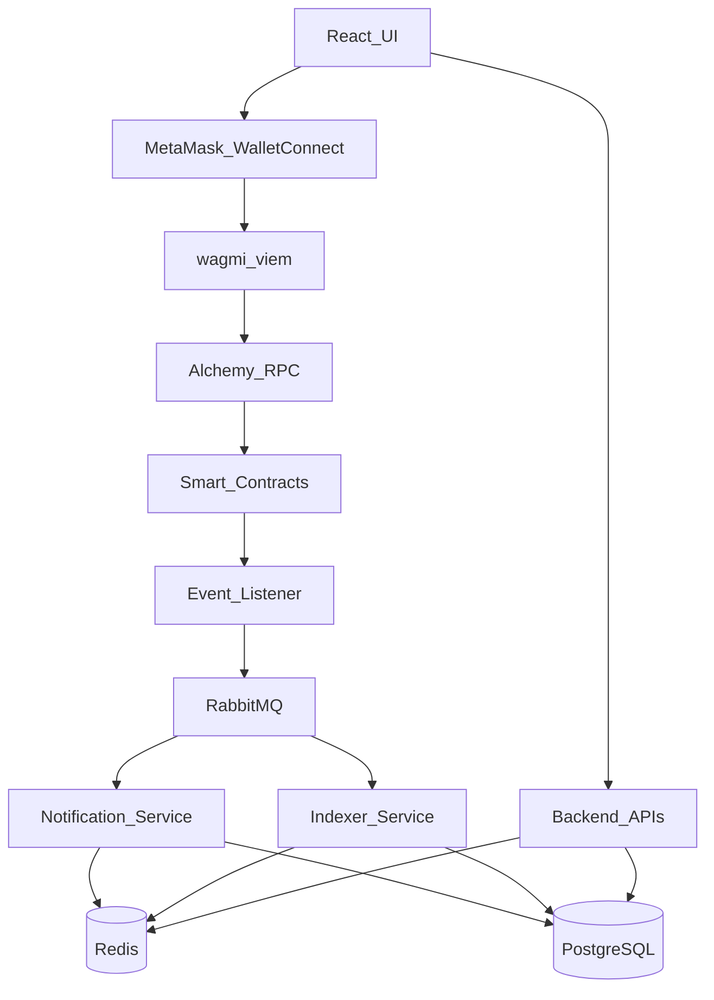

# Three-Repo Blockchain Scaffold

## Layout

Parent folder [`Etherum-backed`](.) stays a non-git workspace holding the plan doc. Three sibling projects, each with its own `.git`:

```
Etherum-backed/
  block-chain-plan.md
  backend/          # NestJS — own git remote
  frontend/         # React Vite — own git remote
  contracts/        # Hardhat — own git remote
```



## 1. Backend (`backend/`)

**Stack:** NestJS, Prisma, PostgreSQL, Redis, RabbitMQ (amqplib / `@nestjs/microservices`), ethers.js for chain reads.

**Structure:**

- `apps/api` — REST/GraphQL-ready HTTP API (JWT/wallet auth stub, health, indexed entity queries)
- `apps/event-listener` — watches contract events via Alchemy WS/HTTP, publishes to RabbitMQ
- `apps/indexer` — consumes chain events, writes normalized rows to Postgres, caches in Redis
- `apps/notification` — consumes events, stores/delivers notification stubs (in-app + console)
- Shared: `libs/prisma`, `libs/common` (config, DTOs)
- `docker-compose.yml` — PostgreSQL, Redis, RabbitMQ (management UI)
- Prisma schema: `User`, `IndexedEvent`, `Notification`, `SyncCursor`
- `.env.example` — `DATABASE_URL`, `REDIS_URL`, `RABBITMQ_URL`, `ALCHEMY_RPC_URL`, `CONTRACT_ADDRESS`, `CHAIN_ID`
- Root scripts: `start:api`, `start:listener`, `start:indexer`, `start:notification`, `docker:up`
- Own `.gitignore`, `README.md`, `git init` (no remote until you add one)

**Scaffold approach:** NestJS monorepo (`nest new` + apps) or equivalent hand-structured Nest workspace so all four processes share Prisma/config.

## 2. Frontend (`frontend/`)

**Stack:** Vite + React + TypeScript, wagmi + viem, RainbowKit or plain MetaMask connector, TanStack Query, Material UI (MUI) — no Tailwind.

**Structure:**

- MUI `ThemeProvider` + CssBaseline; layout with AppBar, Container, Stack/Box
- Wallet connect (MetaMask primary; WalletConnect via wagmi connectors)
- Pages: Home, Connect, Activity (reads from backend API), Contract interaction stub (read/write via wagmi) — built with MUI components (Button, Card, Typography, TextField, etc.)
- API client pointing at `VITE_API_URL`
- Env: `VITE_API_URL`, `VITE_ALCHEMY_API_KEY`, `VITE_WALLETCONNECT_PROJECT_ID`, `VITE_CHAIN_ID`, `VITE_CONTRACT_ADDRESS`
- Own `.gitignore`, `README.md`, `git init`

**UI note:** Minimal functional shell (connect + activity + contract stub)—not a marketing landing page.

## 3. Contracts (`contracts/`)

**Stack:** Hardhat + TypeScript + OpenZeppelin, ethers v6.

**Structure:**

- Sample contract (e.g. `SimpleRegistry` or `Counter` emitting events the listener will index)
- Tests, deploy scripts (local + Sepolia placeholders)
- Hardhat config for localhost / Sepolia; Alchemy URL via env
- Artifacts/ABI export path documented for backend + frontend consumption
- Own `.gitignore`, `README.md`, `git init`

## 4. Git strategy

For each of `backend`, `frontend`, `contracts`:

1. `git init`
2. Initial commit with scaffold
3. You add remotes later, e.g.:
   - `cd backend && git remote add origin <backend-repo-url>`
   - same for frontend and contracts

Parent `Etherum-backed` remains **without** a root `.git` so the three repos stay independent.

## 5. Local run order (documented in READMEs)

1. `contracts`: `npx hardhat node` + deploy → copy address/ABI
2. `backend`: `docker compose up -d` → Prisma migrate → start api + listener + indexer + notification
3. `frontend`: set env with contract address + API URL → `npm run dev`

## Defaults locked in

- RabbitMQ (not Kafka) for the message bus
- NestJS monorepo with four apps
- Hardhat for contracts (not Foundry)
- Frontend UI: Material UI (MUI), not Tailwind
- No root monorepo tooling (Turborepo/pnpm workspace) across the three folders—only within backend if Nest needs it
- Remotes not created here; you supply GitHub URLs when ready to push
